# Practica 2.6

## Introduccion
 En esta practica vamos a Desplegar con Tomcat9 y Maven. 


## Primero descargamos tomcat9:
Usando el comando wget y la ruta del gz

## Luego lo extraemos y le cambiamos el nombre

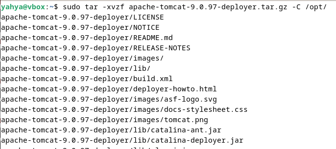
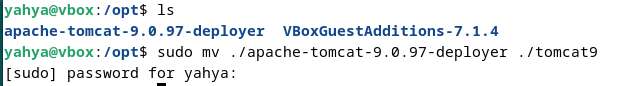

## Establecimos el propietario

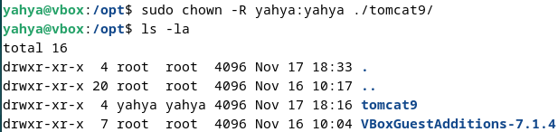

## Decargamos JDK:

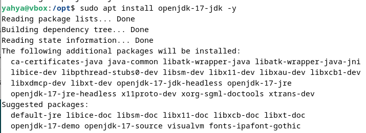

## Instalamos Tomcat manualmente:
### Establecimos las variables de entorno:

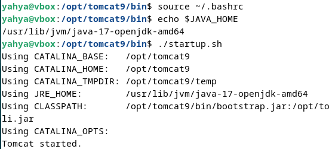

### Accedemos a la interfaz de tomcat.

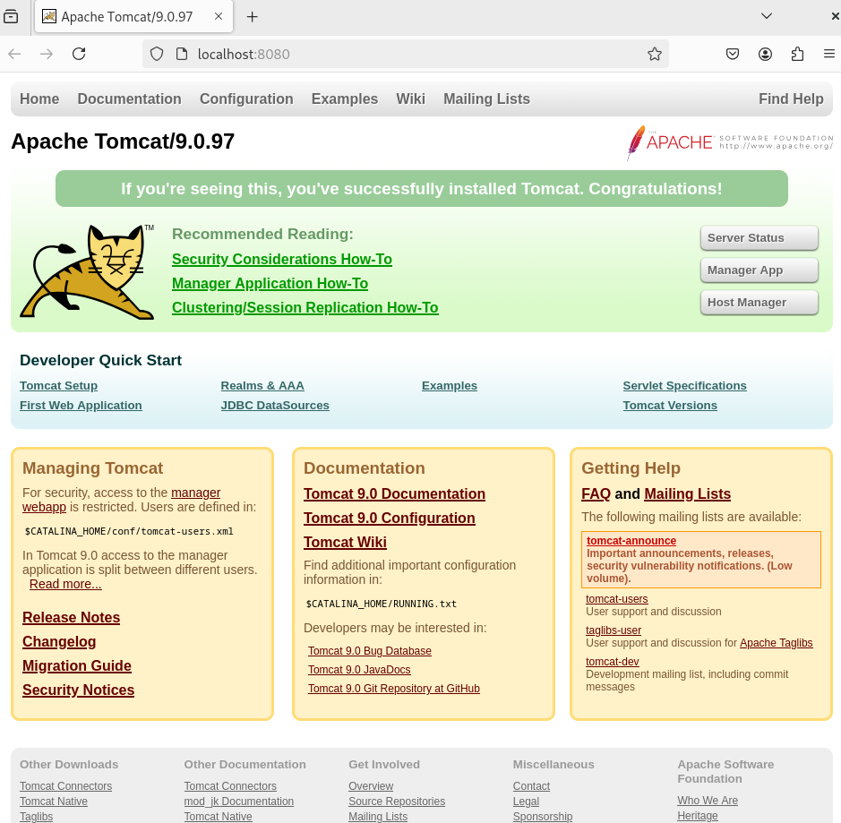

### Creamos el usuario admin que seria yahya en mi caso

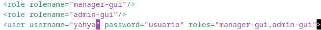

### Desplegamos el .war de ejemplo para probar

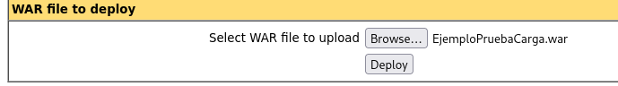

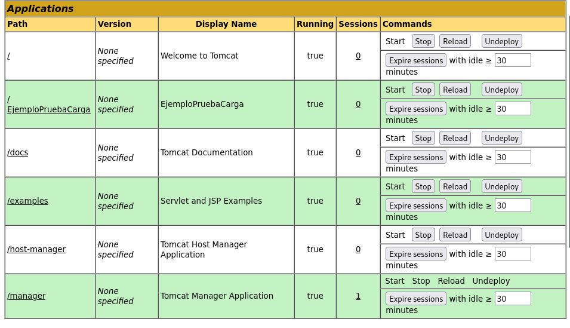

## Pasamos ya a la instalacion de Maven

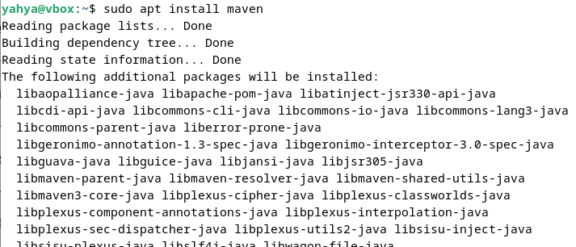

## Estalbecimos lso roles de usuarios

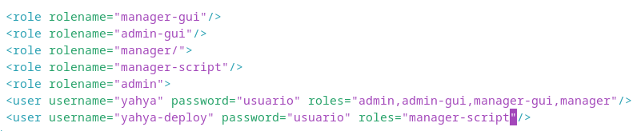

## Establecimos el ID del servidor en ```/etc/maven/settings.xml```

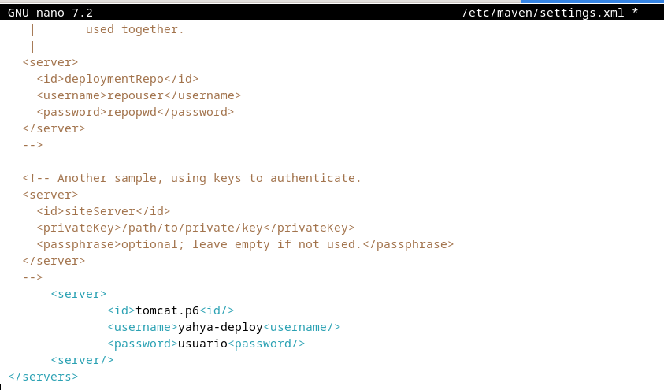

## Generamos un proyecto Marven

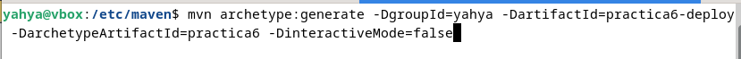


## Configuramos el pom.xml de nuestro proyecto generado por Maven.

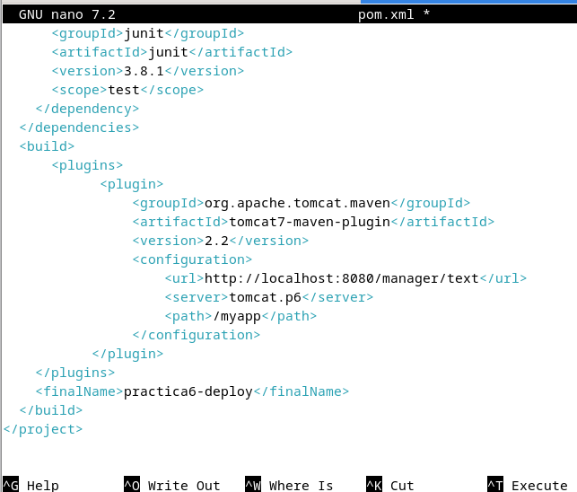

Lo demas no me ha ido bien creo que era por la version del plugin de marven.
