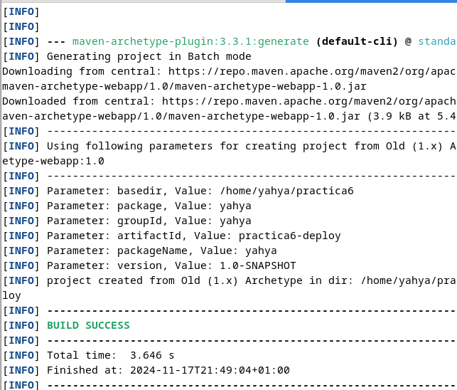

# Practica 2.6

## Introduccion
 En esta practica vamos a Desplegar con Tomcat9 y Maven. 


## Primero descargamos tomcat9:
Usando el comando wget y la ruta del gz

## Luego lo extraemos y le cambiamos el nombre


## Establecimos el propietario


## Decargamos JDK:


## Instalamos Tomcat manualmente:
### Establecimos las variables de entorno:


### Accedemos a la interfaz de tomcat.


### Creamos el usuario admin que seria yahya en mi caso


### Desplegamos el .war de ejemplo para probar


## Pasamos ya a la instalacion de Maven


## Estalbecimos lso roles de usuarios


## Establecimos el ID del servidor en ```/etc/maven/settings.xml```


## Generamos un proyecto Marven





## Configuramos el pom.xml de nuestro proyecto generado por Maven.


Lo demas no me ha ido bien creo que era por la version del plugin de marven.
